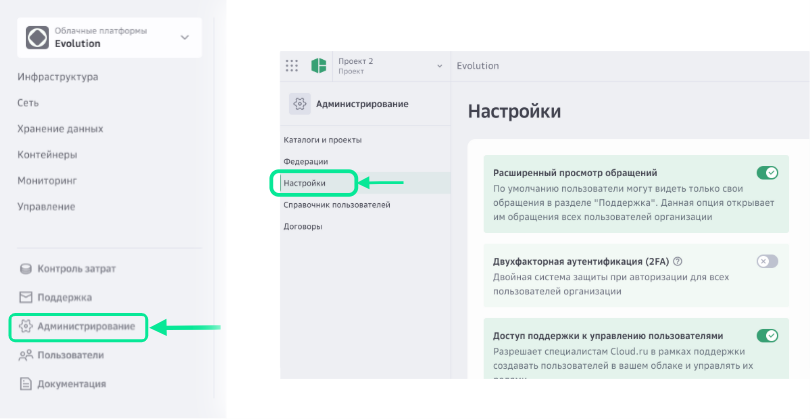
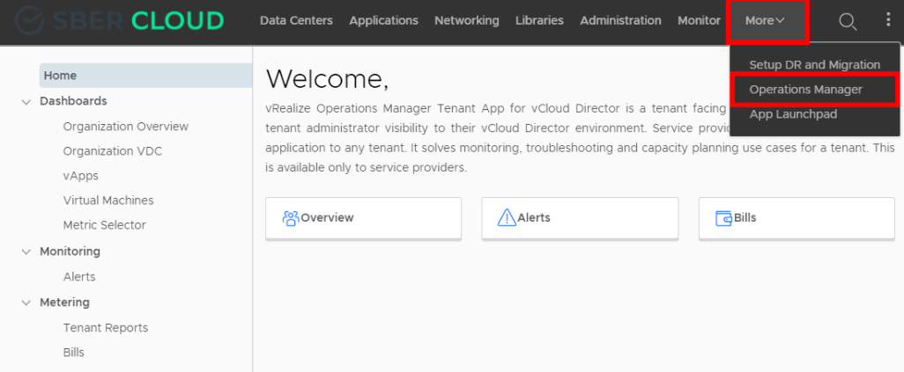
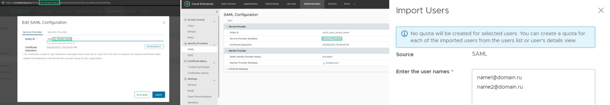
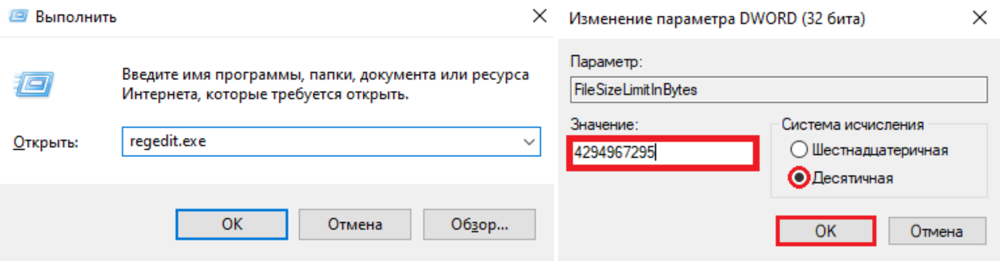
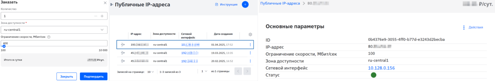
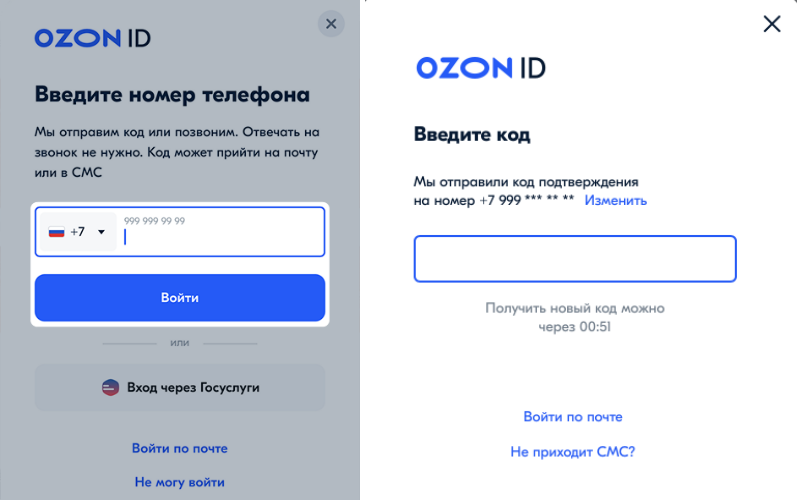
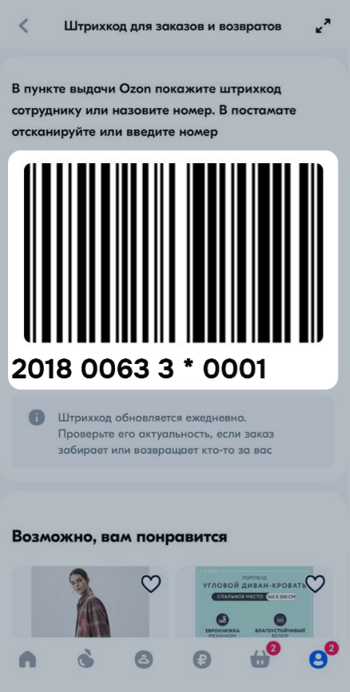

## Активация двухфакторной аутентификации

Чтобы включить двухфакторную аутентификацию:
1.	Перейдите в раздел **Администрирование**, на вкладку **Настройки**.
2.	Переведите переключатель опции **Двухфакторная аутентификация** в правое положение.

Требование двухфакторной аутентификации включено для всех пользователей облака. После этого каждому пользователю в профиле или во время входа будет предложено выбрать и настроить один из способов.

После включения двухфакторной аутентификации всем сотрудникам организации потребуется вводить одноразовый пароль при входе в личный кабинет

## Вход в сервис Operations Manager

Доступ к Operations Manager появится после подключения услуги **Расширенный мониторинг VMware vRealize Operations**.

1.	Авторизуйтесь в **VMware Cloud Director**.
2.	Укажите логин, пароль и нажмите **SIGN IN**.

Письмо с этими данными мы отправляем при подключении.

Чтобы открыть **VMware vRealize Operations Manager**, перейдите в раздел **More → Operations Manager**.

Откроется страница Home, на которой в меню слева отображаются разделы:

* *Dashboards*;
* *Monitoring — Alerts*;
* *Metering — Tenant Reports*.

## Настройка в VMware Cloud Director

1.	В разделе **Administration** в меню слева выберите **SAML**.
2.	Нажмите **EDIT**.
3.	На вкладке **Service Provider** в поле **Entity ID** укажите идентификатор в формате `vcd_ + Название вашего тенанта`. Например, `vcd_my-tenant-name`.

> Название тенанта можно скопировать из URL-адреса.

4.	Нажмите **REGENERATE**, затем в открывшемся окне — OK.
5.	На вкладке **Identity Provider**:

    а. Активируйте переключатель **Use SAML Identity Provider**.
    б. В поле **Metadata XML** добавьте содержимое XML-файла.

6.	Нажмите **SAVE**. Окно настроек закроется и вы останетесь в разделе **SAML**.

В поле **SAML Identity Provider enabled** должна появиться отметка `true`.

7.	Нажмите на ссылку в поле Metadata. Это запустит загрузку XML-файла, который позже необходимо передать в Cloud.ru для настройки доступа.
8.	Перейдите в раздел **Users**.
9.	Выберите одного из пользователей, нажав на переключатель слева от имени.
10.	Сверху списка пользователей появится кнопка IMPORT USERS. Нажмите на нее, чтобы создать нового пользователя с типом `SAML`.
11.	В открывшемся окне:

    а. В поле **Enter the user names** укажите email пользователя, которому необходимо дать доступ через Личный кабинет. Если у вас пока нет доступа к Личному кабинету, мы создадим учетную запись, используя указанный email.

    > Пользователей может быть несколько. Email каждого пользователя указывайте на новой строке.

    б. Внизу страницы в поле **Assign Role** выберите роль для пользователей, указанных выше.

12.	Нажмите **SAVE**.

## Распознавание речи с помощью Playground

Чтобы распознать речь из аудиофайла через **SpeechKit Playground**:
1.	В консоли управления выберите каталог, в котором вы будете работать с сервисом.
2.	Перейдите в сервис **SpeechKit**.
3.	На панели слева выберите  **SpeechKit Playground**.
4.	Перейдите на вкладку **Распознавание речи**.
5.	В блоке Параметры распознавания:

* *Язык* — выберите нужный язык или оставьте значение Автоматически.
* *Нормализация текста* — представляет даты и время в цифровом формате, преобразовывает числа из словарного в цифровой формат и открывает доступ к дополнительным настройкам.
* *Фильтрация обсценной лексики* — маскирует обсценную лексику.
* *Литературный текст* — добавляет заглавные буквы и знаки пунктуации.
* *Определение дикторов* — размечает, какому из дикторов принадлежит каждая распознанная фраза.
* *Группировка фраз дикторов* — разделяет фразы на две группы по дикторам.

6.	Нажмите **Выбрать файл** или перетащите аудиофайл в зону загрузки.

> **Совет:** Заранее конвертируйте файл в поддерживаемый аудиоформат: MP3, WAV или OGG с аудиокодеком OPUS. Максимальный размер файла — 60 МБ.

7.	Нажмите  **Распознать**, чтобы распознать речь в аудиофайле.

Распознавание может занять от нескольких секунд до нескольких минут в зависимости от размера аудиофайла.

8.	Нажмите  **Посмотреть код**, чтобы получить код запроса для Python REST или Python gRPC.

**SpeechKit Playground** предоставляет базовые возможности распознавания речи. Более гибкие настройки распознавания доступны только через API.

## Ошибка Windows: (223): Размер файла превышает допустимый предел и не может быть сохранен

Ошибка возникает при открытии файла, доступ к которому настроен по протоколу WebDAV, если размер файла превышает 50 МБ.

Чтобы устранить ошибку:
1. Нажмите на клавиатуре сочетание клавиш **Win + R**.
2. В поле **Открыть** введите `regedit` и нажмите на кнопку **ОК**:
3. Перейдите в раздел **HKEY_LOCAL_MACHINE\SYSTEM\CurrentControlSet\Services\WebClient\Parameters**.
4. В правой части окна дважды щёлкните левой кнопкой мыши на параметр `FileSizeLimitInBytes`.

> **Примечание:** Если параметр `FileSizeLimitInBytes` отсутствует, создайте его:

    1.	Щёлкните правой кнопкой мыши на пустом месте в правой панели и выберите **Создать → Параметр DWORD (32 бита)**.
    2.	Назовите новый параметр `FileSizeLimitInBytes`.

5. Выберите Десятичную систему исчисления и введите **Значение**, превышающее размер файла, который вы хотите открыть:
6. Нажмите на кнопку **ОК**.
7. Закройте редактор реестра и перезагрузите компьютер.

## Просмотр идентификатора платежного аккаунта

У каждого платежного аккаунта есть идентификатор.

Чтобы узнать идентификатор платежного аккаунта:
1.	Перейдите в сервис **Yandex Cloud Billing**.
2.	Выберите аккаунт, идентификатор которого хотите узнать.

Идентификатор платежного аккаунта отображается на странице Данные аккаунта в блоке Общие сведения.

## Создание публичного IP-адреса

Чтобы создать публичный IP-адрес:
1.	Выберите проект, в котором нужно создать публичный IP-адрес.
2.	Если сервис Cloud Engine не подключен, подключите его.
3.	В главном меню портала перейдите в раздел **Ресурсы → Cloud Engine → Публичные IP-адреса**.
4.	Нажмите на кнопку **Создать**.
5.	Заполните поля:

* *Количество* — количество IP-адресов. За один раз можно заказать максимум 5 публичных IP-адресов;
* *Зона доступности* — зона доступности, в которой нужно создать публичный IP-адрес;
* *Ограничение скорости, Мбит/сек* — лимит пропускной способности канала. Значение должно быть кратно 100.

6.	Нажмите на кнопку **Подтвердить**. IP-адрес выдаётся из пула свободных IP-адресов случайным образом.

Созданный IP-адрес отобразится в списке.

Чтобы посмотреть подробную информацию о публичном IP-адресе, нажмите на строку с нужным IP-адресом. Откроется страница с основными параметрами публичного IP-адреса.

Если публичный IP-адрес не подключен к сетевому интерфейсу, отображается **История действий пользователя** с публичным IP-адресом.

## Оформить предзаказ товара

Оформить предзаказ могут только физические лица. Предзаказ оформляется отдельно от других заказов, в нем может быть только один товар.

Чтобы оформить предзаказ:

1.	На карточке товара нажмите **Перейти → Оформить предзаказ**.
2.	Выберите способ получения и способ оплаты.
3.	Нажмите Оформить предзаказ.

После оплаты заказа вы сможете выбрать удобное время доставки в разделе Заказы. Вы получите пуш-уведомление, СМС и письмо на почту для выбора времени доставки.

Чтобы не пропустить старт продаж, подпишитесь на уведомления. Для этого нажмите Сообщить о начале продаж. Если предварительная продажа еще недоступна, нажмите **Сообщить о старте предзаказа**. Вы получите пуш-уведомление и письмо на почту.

## Вход на Ozon по телефону

Чтобы войти на Ozon по номеру телефона:
1.	На главной странице сайта правом верхнем углу нажмите кнопку аккаунта.
2.	Введите номер телефона и нажмите **Войти**.
3.	Вам придет код подтверждения одним из способов:

* пуш-уведомление и сообщение в чат **«Безопасность»**,
* звонок на телефон,
* СМС-сообщение,
* письмо на электронную почту.

4.	Введите последние 6 цифр номера телефона, который звонил, или код из сообщения.

## Получение заказа в мобильном приложении

Для получения заказа в пункте выдачи Ozon покажите сотруднику штрихкод или назовите цифровой код.

Для того, чтобы открыть штрихкод в мобильном приложении:
1.	Откройте штрихкод одним из способов:

* Перейдите в личный кабинет и нажмите **Получить по штрихкоду на заказе**, готовом к выдаче.
* Перейдите в раздел **Заказы** и откройте нужный заказ.

2.	Покажите штрихкод сотруднику пункта выдачи Ozon или продиктуйте ему расположенные под штрихкодом цифры.

## Создание папки компании в Т1 Диск

Чтобы создать папку компании:
1.	Выберите папку, размещенную в Т1 Диск.
2.	Нажмите на кнопку **Публичная ссылка** или выберите пункт **Публичная ссылка** в контекстном меню папки. 
3.	Перейдите на вкладку **Поделиться**.
4.	Активируйте переключатель **Показывать в списке папок компании**.
5.	Нажмите на кнопку **Готово**.

В результате папка размещается в разделе Папки компании. Она видна всем пользователям, но доступ к содержимому папки нужно запрашивать каждому пользователю самостоятельно.

## Установка и настройка S3 Browser

Чтобы установить и настроить S3 Browser:
1.	Создайте статические ключи для Объектного хранилища S3.
2.	Скачайте программу с официального сайта https://s3browser.com/ и установите ее.
3.	После установки появится окно для настройки нового аккаунта.
4.	Заполните поля:

* *Display name* — имя аккаунта для подключения к Объектному хранилищу S3;
* *Account type* — выберите S3 Compatible Storage;
* *API endpoint* — адрес Endpoint Объектного хранилища S3:
    * https://api.s3.dp.t1.cloud — для Объектного хранилища S3 AZ0;
    * https://api.s3.az1.t1.cloud — для Объектного хранилища S3 AZ1;
    * https://api4.s3.mz1.t1.cloud — для Объектного хранилища S3 MZ1;
* *Access Key ID* — значение `Access key`, полученное при создании статических ключей;
* *Secret Access Key* — значение `Secret`, полученное при создании статических ключей;
* *Encrypt Access Keys with a password* — установите флажок, если нужно шифровать публичные ключи паролем;
* *Use secure transfer (SSL/TLS)* — установите флажок, если нужно использовать защищенное HTTPS-соединение.

5.	Нажмите на кнопку **Add new account**.

После успешного подключения отобразится список бакетов, владельцем которых является сервисный аккаунт, ключи (`Access Key ID` и `Secret Access Key`) которого были указаны при настройке S3 Browser.

## Изменение параметров виртуальной машины

Чтобы изменить параметры виртуальной машины:
1.	Войдите в VMware-организацию, в которой нужно изменить параметры виртуальной машины.
2.	На платформе **VMware Cloud Director** перейдите в раздел **Applications → Virtual Machines**.
3.	Остановите виртуальную машину, если она не в статусе **Powered off (Выключено)**.
4.	Нажмите на название виртуальной машины, параметры которой нужно изменить, и на вкладке **General** нажмите на кнопку **EDIT**. 
5.	Измените нужные поля:

* **General Settings:**
    * *Name* * — имя виртуальной машины;
    * *Computer Name* * — имя устройства, которое отображается в ОС (операционной системе), установленной на виртуальной машине;
    * *Description* — описание виртуальной машины, заполняется при необходимости;
    * *Storage Policy* — политика хранения данных.
* **Operating System** — операционная система для виртуальной машины:
    * *Operating System Family* — семейство ОС;
    * *Operating System* — ОС, которая будет установлена на виртуальной машине. При выборе ОС Windows Server активируйте коммерческую лицензию на нее.
* **Boot Options** — параметры загрузки ОС:
    * *Boot Firmware* — программа для загрузки ОС, проверки, диагностики и управления оборудованием перед загрузкой ОС:
        * *BIOS*;
        * *EFI*;
* Boot Delay * — время задержки загрузки ОС в миллисекундах;
* Enter Boot Setup — при необходимости активируйте переключатель, чтобы в настройках загрузки ОС можно было изменить порядок загрузки устройств или выбрать конкретное устройство для загрузки ОС;
* Failed Boot Recovery — при необходимости активируйте переключатель, чтобы перезагрузить виртуальную машину после сбоя загрузки ОС, и в поле Failed Boot Recovery Delay укажите количество секунд, через которое автоматически начнется новая попытка загрузки ОС.

6.	Нажмите на кнопку SAVE.
7.	Нажмите на кнопку ALL ACTIONS и выберите пункт Power → Power On, Force Recustomization, чтобы запустить виртуальную машину с измененными данными. Статус виртуальной машины с Powered off (Выключено) изменится на Powered on (Включено).

## Изменение настроек СУБД PostgreSQL

Чтобы изменить настройки СУБД:
1.	Перейдите в раздел **Ресурсы → Базы данных → Managed Service for PostgreSQL**.
2.	Нажмите на строку с нужным кластером и откройте вкладку **Настройки СУБД**.
3.	Измените значения параметров:

* *work_mem* — объем памяти в байтах, который может быть использован для операций сортировки и хеширования в рамках одного запроса;
* *autovacuum* — автоматический процесс в PostgreSQL, который выполняет задачи очистки и анализа таблиц (VACUUM и ANALYZE) для поддержания производительности базы данных;
* *seq_page_cost* — приблизительная стоимость чтения одной страницы с диска, которое выполняется в серии последовательных чтений;
* *shared_buffers* — объем памяти в байтах, выделяемой для кэширования данных PostgreSQL;
* *max_connections* — максимальное число одновременных подключений к серверу БД, не менее 10;
* *max_wal_senders* — максимально допустимое число одновременных подключений ведомых серверов или клиентов потокового копирования, от 10 до 100;
* *random_page_cost* — приблизительная стоимость чтения одной произвольной страницы с диска;
* *autovacuum_naptime* — интервал времени в секундах между циклами работы autovacuum-демона. Определяет, как часто PostgreSQL будет проверять таблицы на необходимость выполнения операций VACUUM и ANALYZE;
* *effective_cache_size* — объем памяти в байтах, который PostgreSQL предполагает доступным для кеширования данных операционной системой; 
* *maintenance_work_mem* — объем памяти в байтах, который может быть использован для операций обслуживания, таких как VACUUM, CREATE INDEX, ALTER TABLE и т.д. Параметр влияет на скорость выполнения этих операций;
* *max_replication_slots* — максимальное число слотов репликации, которое сможет поддерживать сервер, от 10 до 100;
* *effective_io_concurrency* — количество операций ввода-вывода, которые PostgreSQL может выполнять параллельно;
* *default_statistics_target* — количество выборок, используемых для сбора статистики о данных в таблицах;
* *max_locks_per_transaction* — среднее число блокировок объектов, выделяемое для каждой транзакции, от 10 до 4096;
* *max_prepared_transactions* — максимальное число транзакций, которые могут одновременно находиться в подготовленном состоянии, от 0 до 1000. При нулевом значении механизм подготовленных транзакций отключается;
* *autovacuum_vacuum_cost_delay* — задержка в миллисекундах между циклами выполнения операций VACUUM, выполняемых autovacuum-демоном;
* *checkpoint_completion_target* — целевое время для завершения процедуры контрольной точки, как коэффициент для общего времени между контрольными точками, от 0 до 1.

4.	Нажмите на кнопку «Применить изменения».

## Привязка карты к кредитному счету

1.	Нажмите **Привязать карту** на главной или в разделе Кредитная карта.
2.	Нажмите **Выбрать карту**.
3.	Выберите карту, которую нужно привязать к кредитному счёту.
4.	Нажмите **Привязать карту**.

## Перевести деньги со счета

С кредитной карты можно без комиссии перевести деньги между своими счетами или по номеру телефона через СБП.

1.	На главной странице в блоке **Кредитная карта** нажмите **Перевести**.
2.	Выберите **Между своими счетами**.
3.	В блоке **Откуда** укажите Кредитную карту.
4.	В блоке **Куда** выберите **Основной счет**.
5.	Введите сумму перевода.
6.	Нажмите **Перевести**.
7.	Ознакомьтесь с условиями и нажмите **Подтвердить**.

## Оформить заявку на обмен авиабилета

Чтобы оформить заявку на обмен:
1.	В разделе **Заказы** нажмите на заказ.
2.	Нажмите **Обмен билета**.
3.	В блоке с билетом нажмите **Выбрать**.
4.	Заполните заявку:

* выберите пассажиров — можно выбрать всех вместе или по отдельности;
* укажите новые даты.

5.	Нажмите **Добавить в заявку**.
6.	Нажмите **Отправить заявку**.

Отследить статус заявки и решение по ней вы можете в личном кабинете на странице заказа.

Мы проверим возможность обмена, рассчитаем его стоимость и выставим счёт на оплату в личном кабинете.

Обмен будет выполнен только после оплаты счёта. Если вы передумали, не оплачивайте счёт — билет останется без изменений.

## Забронировать номер в приложении

Чтобы забронировать номер:
1.	В блоке **Выбрать номер** выберите номер, вариант размещения и нажмите **Забронировать**.
2.	Заполните поля в блоках **Данные гостей** и **Контакты покупателя**.
3.	При необходимости отметьте дополнительные услуги раннего или позднего заезда, если они доступны.
4.	Заполните поля в блоке **Пожелания к номеру**, если это необходимо. Мы передадим пожелания в отель, но отель не всегда сможет их учесть.
5.	Нажмите **Перейти к оплате**. Если вы выбрали тариф с оплатой в отеле, нажмите **Забронировать**.

## Привязка Ozon ID к бизнес-аккаунту

Чтобы связать Ozon ID с бизнес-аккаунтом:
1.	Откройте сервис, в котором вы хотите авторизоваться. Система автоматически перенаправит вас на страницу авторизации с помощью Ozon ID.
2.	Авторизуйтесь на странице Ozon ID. Если вход уже выполнен в аккаунт другого пользователя, внизу страницы нажмите Выйти из аккаунта. Если вы используете адрес электронной почты, убедитесь, что это тот же адрес, что указан в вашем Ozon ID в блоке **Учётные данные**.
3.	Войдите в бизнес-аккаунт:

* По электронной почте: введите адрес рабочей почты и пароль. Убедитесь, что заходите через свой аккаунт. Если отображаются не ваши данные, нажмите Войти под другим аккаунтом.
* По СНИЛС: нажмите Войти по СНИЛС, введите СНИЛС и дату рождения. Убедитесь, что заходите через свой аккаунт. Если отображаются не ваши данные, нажмите Войти под другим аккаунтом.

> **Примечание:** Войти по СНИЛС могут только сотрудники Ozon.

4.	Нажмите **Войти**. Ваша единая учётная запись будет создана: бизнес-аккаунт будет привязан к вашему Ozon ID.

Если при следующем входе в сервис потребуется авторизация, используйте Ozon ID

## Добавить карту в Mir Pay

Добавить Ozon Карту в Mir Pay можно в приложении Ozon Банка:
1.	В блоке **Основной счёт** нажмите на карту, которую хотите добавить в **Mir Pay**.
2.	Выберите **Добавить в MIR Pay**.
3.	Нажмите Добавить и следуйте подсказкам на экране.